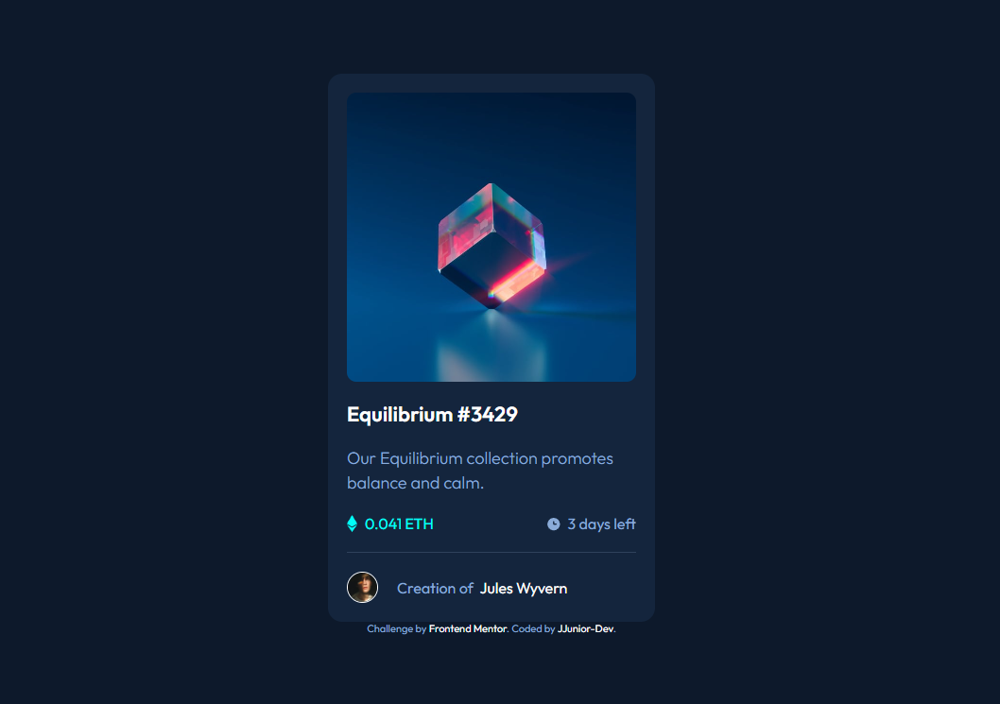

# Frontend Mentor - NFT preview card component solution

This is a solution to the [NFT preview card component challenge on Frontend Mentor](https://www.frontendmentor.io/challenges/nft-preview-card-component-SbdUL_w0U). Frontend Mentor challenges help you improve your coding skills by building realistic projects. 

## Table of contents

- [Overview](#overview)
  - [Screenshot](#screenshot)
  - [Links](#links)
- [My process](#my-process)
  - [Built with](#built-with)
  - [What I learned](#what-i-learned)
  - [Continued development](#continued-development)
  - [Useful resources](#useful-resources)
- [Author](#author)

## Overview

### Screenshot



### Links

- LinkedIn - [Jailton Junior](https://www.linkedin.com/in/dev-jjunior/)
- Live Site URL: [Live site URL]()
- Solution URL: [Solution URL]()

## My process

### Built with

- Semantic HTML5 markup
- CSS custom properties
- Flexbox

### What I learned

I learned how to use ::after ::before Pseudo-elements.

```html
<h1>HTML code I'm proud of</h1>
<div>Div❤️</div>
```
```css
.proud-of-this-css {
  display: flex;
}
```

### Continued development

I want to refine my knowledgment in JavaScript.

### Useful resources

- [W3Schools](https://www.w3schools.com/css/css_pseudo_elements.asp) - This helped me to understand the Pseudo-element selector.

## Author

- LinkedIn - [Jailton Junior](https://www.linkedin.com/in/dev-jjunior/)
- GitHub - [JJunior-Dev](https://github.com/JJunior-Dev)
- Frontend Mentor - [@JJunior-Dev](https://www.frontendmentor.io/profile/JJunior-Dev)
